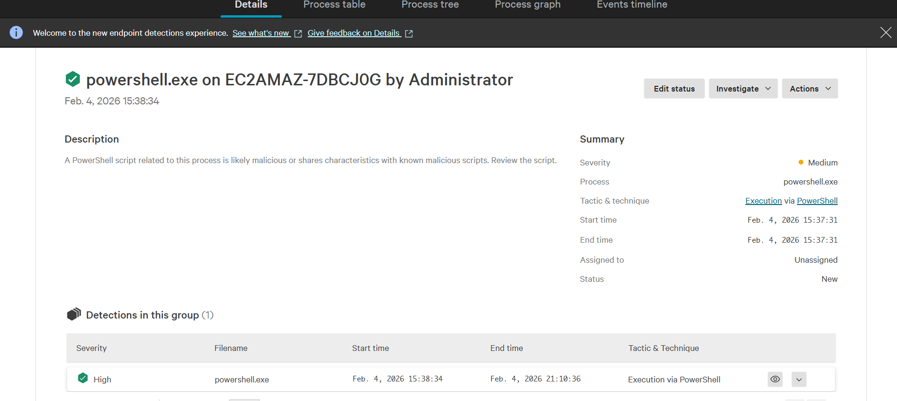
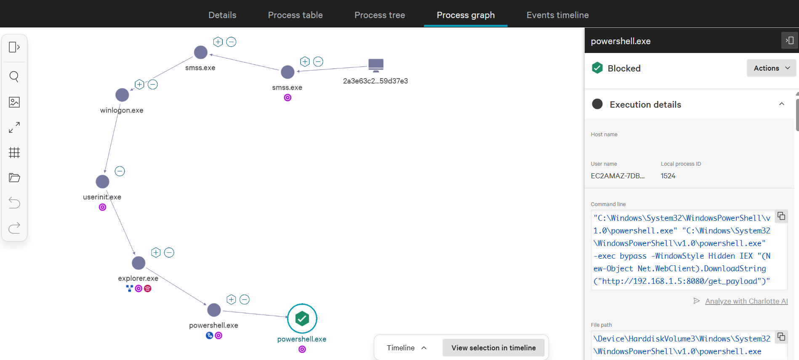
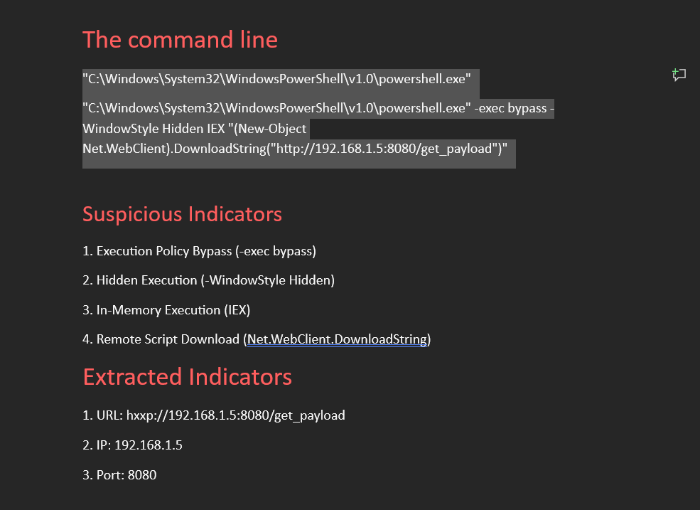
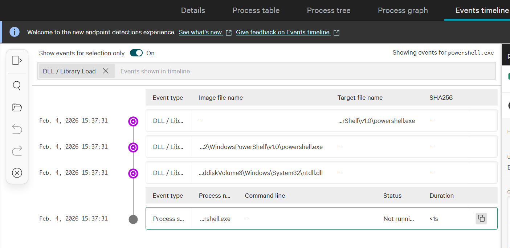
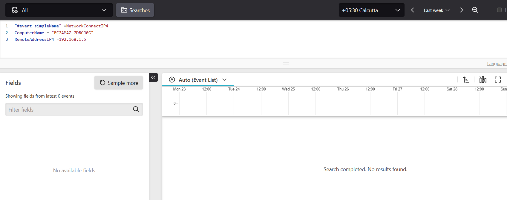

# Malicious PowerShell Execution (True Positive)

## Overview

This lab demonstrates the investigation of a malicious PowerShell execution detected by CrowdStrike Falcon EDR. The alert was triggered after PowerShell was launched with suspicious command-line arguments designed to bypass execution restrictions, execute without user visibility, and download a remote script from an external source.

The investigation focused on validating the alert, analyzing the execution chain, extracting indicators of compromise (IOCs), reviewing endpoint telemetry, and determining the final verdict.

---

## Detection Summary

| Field | Value |
|--------|-------|
| Platform | CrowdStrike Falcon EDR |
| Alert Type | Malicious PowerShell Execution |
| Severity | High |
| Detection Status | True Positive |
| Analyst Verdict | Confirmed Malicious Activity |

---

## Investigation Steps

### 1. Detection Details

The investigation began by reviewing the CrowdStrike detection, including the alert severity, affected endpoint, detection time, and process information.

**Evidence**

---

### 2. Process Graph Analysis

The process tree was reviewed to understand the execution chain and identify the parent-child relationship responsible for launching PowerShell.

The process graph showed:

- PowerShell launched from **explorer.exe**
- Suspicious PowerShell execution
- Command-line parameters requiring further investigation

**Evidence**

---

### 3. Command-Line Analysis & IOC Extraction

The PowerShell command line was analyzed to identify malicious behaviors and extract indicators of compromise.

Observed indicators included:

- Execution Policy Bypass
- Hidden Execution
- In-Memory Execution (IEX)
- Remote Script Download

Extracted IOCs:

- URL: `hxxp://192.168.1.5:8080/get_payload`
- IP Address: `192.168.1.5`
- Port: `8080`

**Evidence**

---

### 4. Timeline Analysis

The endpoint timeline was reviewed to reconstruct the sequence of events surrounding the alert.

The timeline confirmed:

- PowerShell execution
- Command-line activity
- CrowdStrike detection event
- Execution sequence for further investigation

**Evidence**

---

### 5. IOC Hunt

The extracted IOC was searched within LogScale to identify any additional endpoint activity associated with the detected IP address.

The investigation did not identify matching `NetworkConnectIP4` telemetry for the extracted IP address during the review.

**Evidence**

---

## MITRE ATT&CK Mapping

| Tactic | Technique | Justification |
|--------|-----------|---------------|
| Execution | [T1059.001 – Command and Scripting Interpreter: PowerShell](https://attack.mitre.org/techniques/T1059/001/) | The alert was triggered by malicious PowerShell execution using execution policy bypass, hidden execution, and in-memory script execution (IEX). |

---

## Key Findings

- CrowdStrike detected suspicious PowerShell execution.
- PowerShell was executed with execution policy bypass enabled.
- The process executed with a hidden window.
- `Invoke-Expression (IEX)` was used for in-memory execution.
- `Net.WebClient.DownloadString()` attempted to retrieve a remote PowerShell script.
- Indicators of compromise were successfully extracted.
- Timeline analysis confirmed the sequence of execution.
- IOC hunting found no matching `NetworkConnectIP4` telemetry for the extracted IP.

---

## Conclusion

The investigation confirmed that the alert represented a **True Positive** based on the observed malicious PowerShell behavior. The command line contained multiple indicators commonly associated with fileless attacks, including execution policy bypass, hidden execution, in-memory execution, and remote script retrieval.

Although no matching network telemetry was identified during IOC hunting, the behavioral evidence provided by CrowdStrike Falcon was sufficient to classify the activity as malicious.
