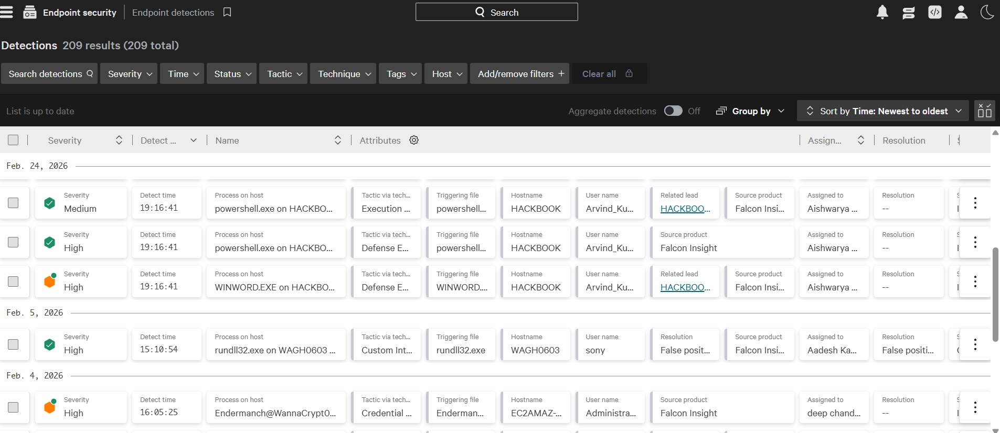
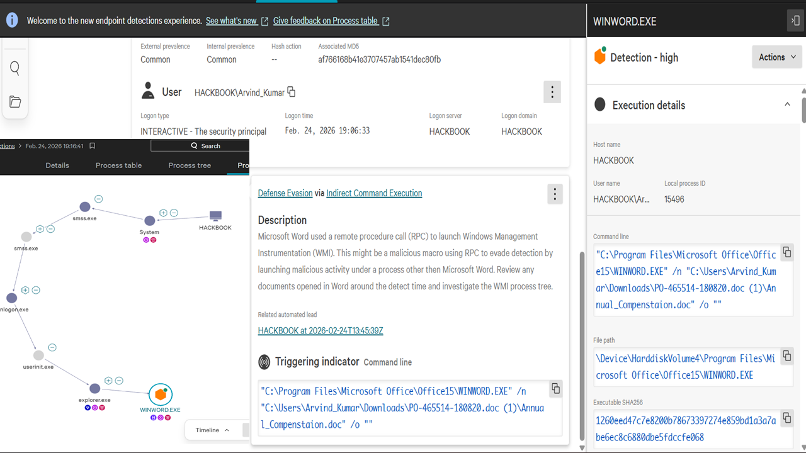
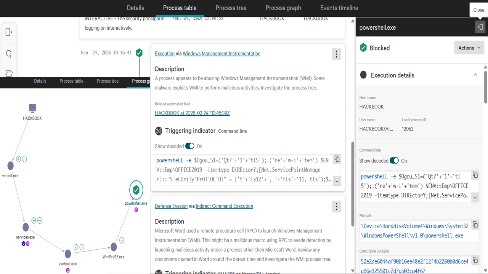
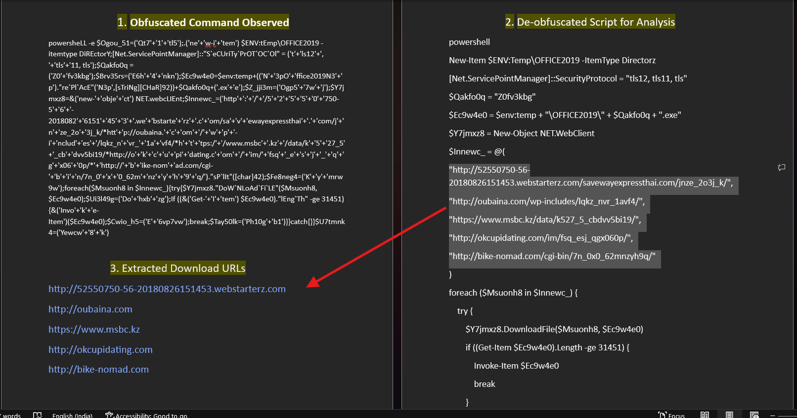
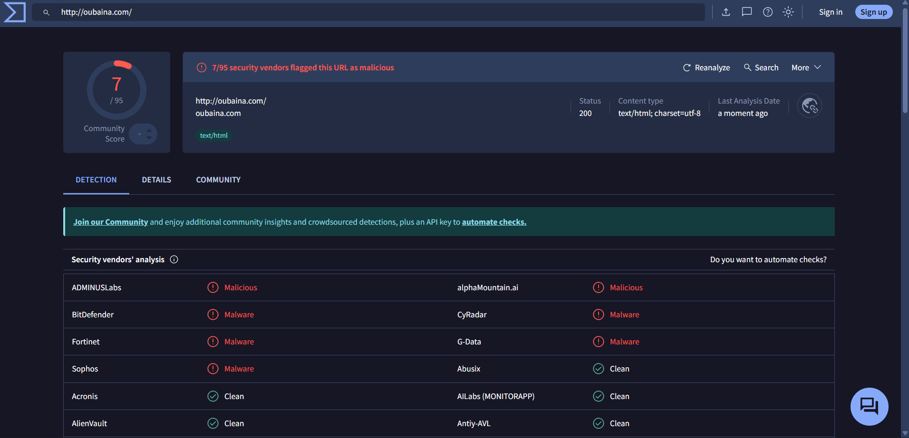
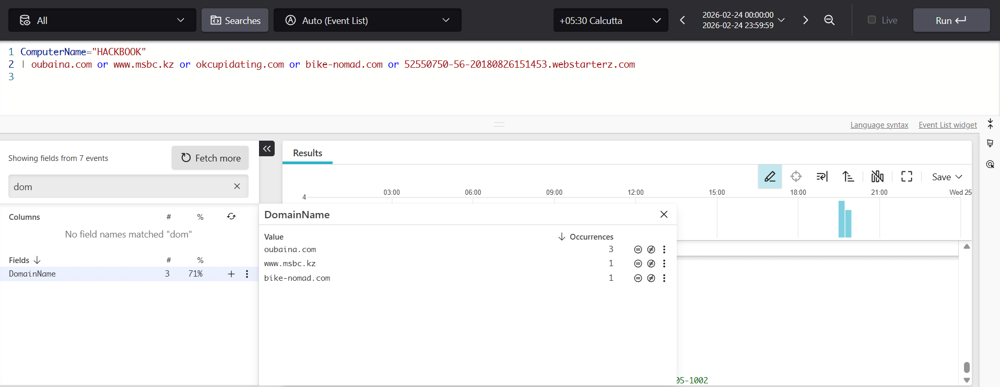
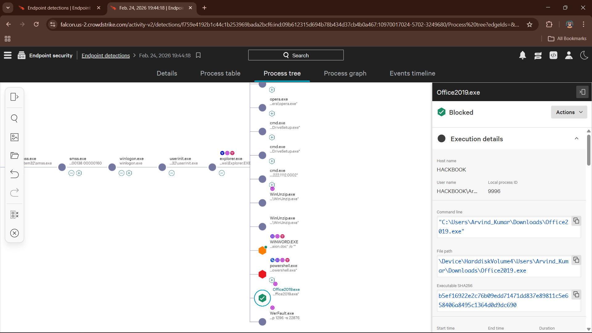
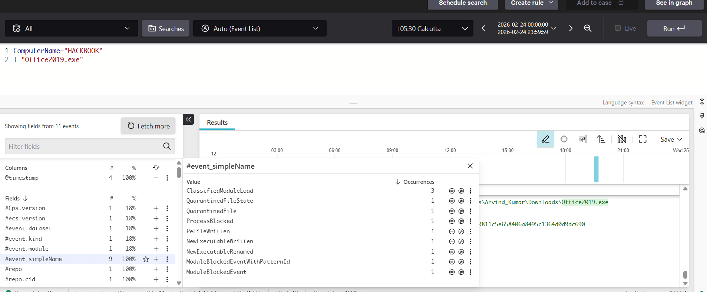
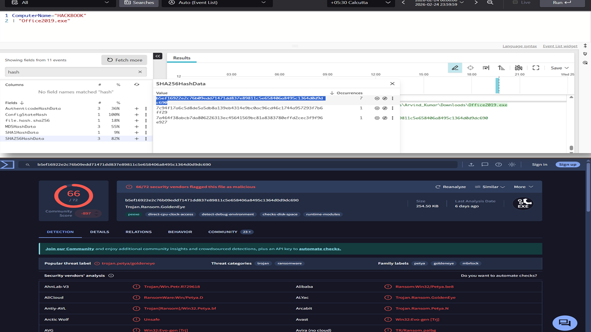
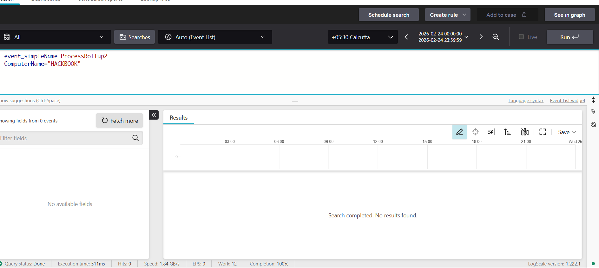

# Microsoft Word Spawning PowerShell to Download a Malicious Payload (True Positive)

## Lab Overview

This lab documents the investigation of a malicious Microsoft Word document that spawned PowerShell to execute an obfuscated script and download an additional payload. CrowdStrike Falcon generated a detection after identifying suspicious process behavior associated with the attack chain.

The investigation confirmed that the alert represented a **True Positive**. Although the payload attempted to execute, CrowdStrike successfully blocked the malicious activity before successful execution occurred.

---

# Environment

| Component | Value |
|-----------|-------|
| EDR Platform | CrowdStrike Falcon |
| Operating System | Windows |
| Investigation Type | Endpoint Detection & Response (EDR) |
| Classification | True Positive |

---

# Investigation

## 1. Initial Detection

CrowdStrike generated an alert after detecting Microsoft Word spawning PowerShell through an abnormal execution chain. Since Microsoft Office applications rarely initiate PowerShell during normal business activity, this behavior immediately warranted investigation.

---

## 2. Process Tree Analysis

The process tree showed that WINWORD.EXE initiated an execution chain that leveraged Windows Management Instrumentation (WMI), ultimately launching PowerShell.exe.

This execution path is highly suspicious because Office applications generally do not spawn PowerShell through WMI during legitimate document usage.

Further analysis confirmed that PowerShell was executed by WMI rather than directly by the user, indicating automated execution initiated by the malicious document.

---

## 3. PowerShell Script Analysis

The PowerShell command contained obfuscated code designed to hide its true functionality.

After decoding the script, multiple Indicators of Compromise (IOCs) were extracted, including external URLs used to retrieve the malicious payload.

---

## 4. Threat Intelligence Validation

The extracted URLs were investigated using VirusTotal.

The analysis confirmed that the infrastructure had previously been identified as malicious, supporting the conclusion that the PowerShell script attempted to communicate with attacker-controlled resources.

A representative VirusTotal result is shown below.

---

## 5. IOC Hunting

The extracted indicators were searched throughout endpoint telemetry to determine whether additional activity associated with the attack existed elsewhere in the environment.

The IOC hunt provided additional context for the investigation and helped validate the observed malicious infrastructure.

---

## 6. Payload Investigation

Process tree analysis identified the downloaded executable **Office2019.exe**.

CrowdStrike endpoint telemetry showed events indicating that the payload had been written to disk and execution was attempted.

Endpoint response events confirmed that CrowdStrike blocked and quarantined the executable before successful execution.

---

## 7. Payload Hash Validation

The SHA-256 hash of the downloaded executable was extracted and investigated using VirusTotal.

VirusTotal classified the file as malicious, providing independent validation that the downloaded payload represented malware.

---

## 8. Execution Verification

Additional hunting was performed using ProcessRollup2 telemetry to determine whether the payload executed successfully after download.

No ProcessRollup2 events associated with the malicious executable were identified.

This evidence supports the conclusion that CrowdStrike prevented successful execution before the malware could fully run.

---

# Investigation Findings

- Microsoft Word initiated an abnormal execution chain.
- WMI launched PowerShell on behalf of the malicious document.
- The PowerShell script was obfuscated and downloaded an executable payload.
- Multiple malicious URLs were extracted and validated through VirusTotal.
- The downloaded payload (**Office2019.exe**) was identified as malicious.
- CrowdStrike blocked and quarantined the executable before successful execution.
- No evidence of successful payload execution was identified during additional hunting.

---

# Evidence Summary

| Evidence | Result |
|----------|--------|
| CrowdStrike Detection | Malicious activity detected |
| Process Tree | WINWORD → WMI → PowerShell |
| PowerShell Analysis | Obfuscated downloader identified |
| IOC Validation | Malicious infrastructure confirmed |
| Payload Investigation | Office2019.exe identified |
| VirusTotal Hash Analysis | Malicious payload confirmed |
| Execution Verification | No successful execution observed |

---

# MITRE ATT&CK Mapping

| Tactic | Technique | Justification |
|--------|-----------|---------------|
| Initial Access | T1566.001 – Spearphishing Attachment | The attack originated from a malicious Microsoft Word document delivered as a phishing attachment. |
| Execution | T1059.001 – PowerShell | PowerShell executed an obfuscated script that downloaded and attempted to launch a malicious payload. |
| Command and Control | T1105 – Ingress Tool Transfer | The PowerShell script downloaded an executable payload from external infrastructure. |

---

# Final Analysis

The alert was initially classified as a **True Positive** by CrowdStrike. An independent investigation was conducted to validate the detection by examining the complete execution chain, PowerShell activity, extracted indicators, threat intelligence, payload behavior, and endpoint telemetry.

The investigation confirmed that the document attempted to execute a malicious PowerShell downloader, retrieve an additional payload, and launch the downloaded executable. CrowdStrike successfully prevented execution before the malware could fully run.

---

# Conclusion

This investigation confirmed a **True Positive** detection involving a malicious Microsoft Word document that leveraged PowerShell to download and execute malware.

Although execution was attempted, CrowdStrike successfully blocked and quarantined the payload before successful execution occurred.

Based on the collected evidence, this activity should be escalated for Incident Response to ensure that no additional systems were exposed and to perform any necessary containment and remediation activities.
