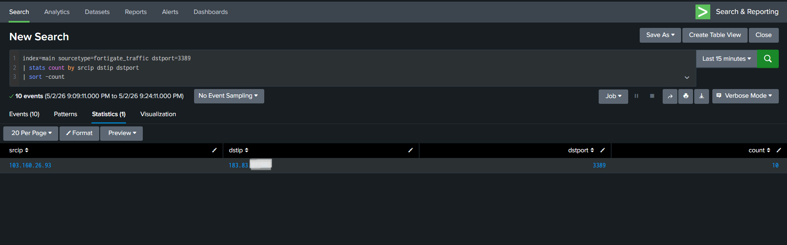
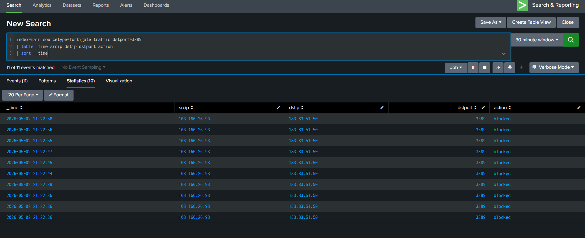
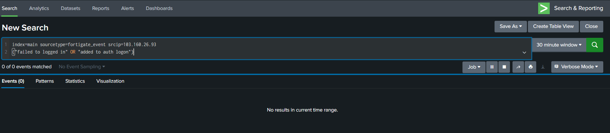

# Firewall RDP Activity – False Positive Analysis

## Lab Overview

This lab demonstrates the investigation of repeated Remote Desktop Protocol (RDP) connection attempts detected in firewall logs within Splunk.

The activity initially appeared suspicious because multiple connections targeted port 3389 (RDP), which is commonly associated with brute-force attacks and unauthorized remote access attempts.

However, after investigation, the activity was determined to be a false positive because:
- the number of attempts was low
- all connections were blocked by the firewall
- no authentication activity was observed
- no evidence of attack progression was identified

The behavior was ultimately classified as benign internet probing rather than a confirmed malicious intrusion attempt.

---

## Environment

| Component | Details |
|---|---|
| SIEM Platform | Splunk Enterprise Security |
| Data Source | FortiGate Firewall Logs |
| Index | main |
| Sourcetype | fortigate_traffic |

---

## Detection Scenario

The firewall logs showed repeated connection attempts targeting RDP port 3389 on the public firewall interface.

This type of activity can potentially indicate:
- brute-force attempts
- internet scanning
- unauthorized remote access attempts

Because RDP is commonly targeted by attackers, the activity required investigation to determine whether malicious authentication attempts or attack escalation occurred.

---

## Detection Logic

The following Splunk query was used to identify repeated RDP connection attempts:

```spl
index=main sourcetype=fortigate_traffic dstport=3389
| stats count by srcip dstip dstport
| sort -count
```

### Detection Query Result



---

## Investigation Process

Additional investigation was performed to validate whether the activity represented malicious behavior or normal internet background probing.

The investigation focused on:
- connection frequency
- firewall actions
- authentication validation
- attack progression indicators

---

### Firewall Investigation Timeline

The following timeline confirmed that all RDP connection attempts were blocked by the firewall.



---

### Authentication Cross-Check

An additional investigation was performed to verify whether any related VPN authentication activity existed.

The following query returned no related authentication events:

```spl
index=main sourcetype=fortigate_event
("failed to logged in" OR "added to auth logon")
```



---

## Final Analysis

Key investigation findings:
- repeated RDP connection attempts were identified
- the number of attempts remained low
- all connections were blocked by the firewall
- no related authentication activity was observed
- no evidence of attack escalation was identified within the available logs

The investigation determined that the activity was consistent with low-volume internet probing behavior rather than a confirmed brute-force attack.

---

## Conclusion

The alert was triggered due to repeated connection attempts targeting RDP port 3389.

Although the activity initially appeared suspicious, investigation confirmed that all connections were blocked by the firewall and no authentication activity was observed. The low volume of activity and absence of attack progression indicators supported the conclusion that the behavior represented benign internet probing rather than a confirmed malicious intrusion attempt.

Therefore, the event was classified as a false positive.
