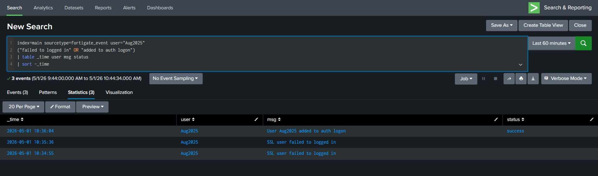
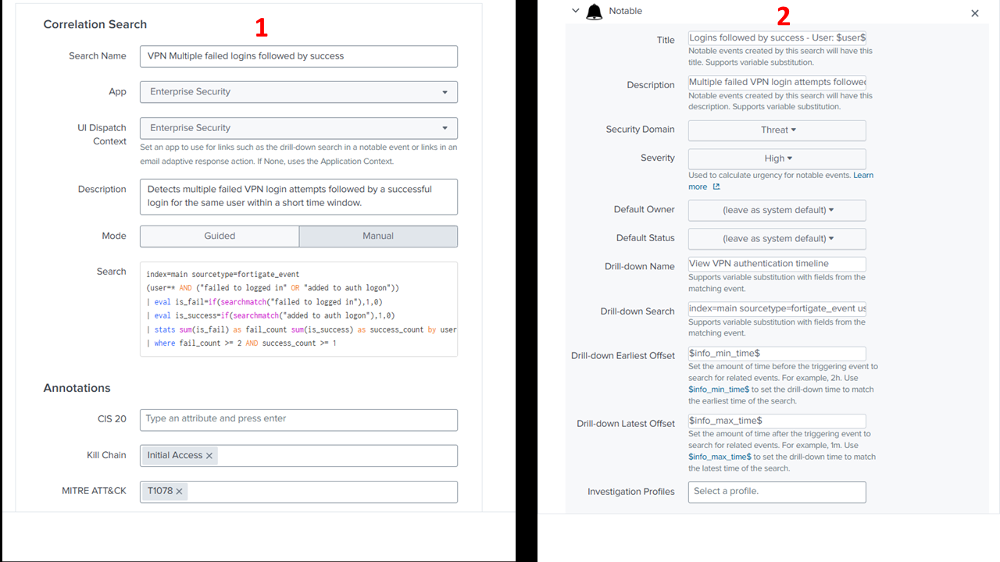
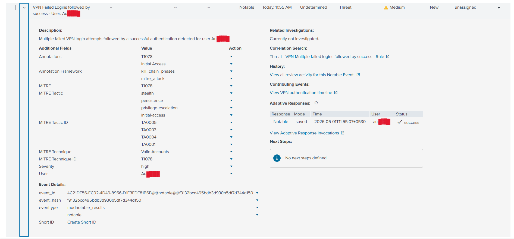
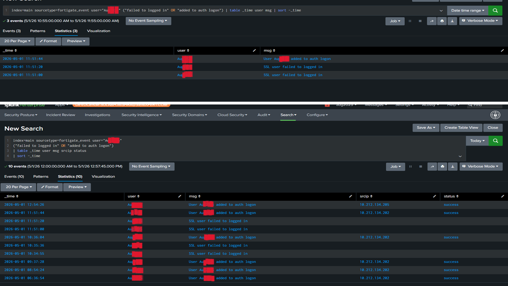

# VPN Failed Logins Followed by Success – False Positive Analysis

## Lab Overview

This lab demonstrates the investigation of suspicious VPN authentication activity detected in Splunk Enterprise Security.

The alert was triggered after multiple failed VPN login attempts were followed by a successful authentication for the same user account within a short time window.

Although the activity initially appeared suspicious and was treated as a high-severity event, further investigation determined that the behavior was consistent with a legitimate user entering incorrect credentials before successfully authenticating.

The activity was ultimately classified as a false positive after validating:
- historical user behavior
- authentication patterns
- source IP context
- absence of malicious follow-up activity

---

## Environment

| Component | Details |
|---|---|
| SIEM Platform | Splunk Enterprise Security |
| Data Source | FortiGate VPN Logs |
| Index | main |
| Sourcetype | fortigate_event |

---

## Detection Scenario

The detection logic identified:
- multiple failed VPN login attempts
- followed by a successful login
- for the same user account
- within a short time window

This behavior can potentially indicate:
- brute-force activity
- credential stuffing
- compromised credentials

As a result, the event was initially treated as a high-severity authentication alert requiring investigation.

---

## Investigation Timeline

The following investigation timeline showed multiple failed login attempts followed by a successful authentication for the same user account within a short period of time.



---

## Detection Logic

The following Splunk query was used to identify multiple failed VPN login attempts followed by a successful authentication for the same user account:

```spl
index=main sourcetype=fortigate_event
("SSL user failed to logged in" OR "added to auth logon")
| eval activity=if(searchmatch("failed"),"Failed Login","Successful Login")
| stats count(eval(activity="Failed Login")) as fail_count count(eval(activity="Successful Login")) as success_count by user
| where fail_count >= 2 AND success_count >= 1
```

### Detection Query Result


---

## Correlation Rule Configuration

A correlation rule was configured in Splunk Enterprise Security to generate a notable event when multiple failed VPN logins were followed by a successful authentication.



---

## Alert Generation

The correlation rule successfully generated a high-severity notable event for investigation.

> Note:
> Splunk Enterprise Security automatically associated multiple MITRE ATT&CK tactics with technique T1078 (Valid Accounts). Although several tactics were displayed by the platform, the actual investigation context primarily aligned with Initial Access because no persistence, privilege escalation, or defense evasion activity was observed.



---

## Source IP and Authentication Validation

Additional investigation confirmed consistent source IP usage and historical successful authentication activity for the same user account.

This behavior supported the conclusion that the activity was consistent with legitimate user behavior rather than malicious compromise.



---

## MITRE ATT&CK Mapping

| Tactic | Technique | ID |
|---|---|---|
| Initial Access | Valid Accounts | T1078 |

- MITRE ATT&CK Technique:
  https://attack.mitre.org/techniques/T1078/

The activity was mapped to MITRE ATT&CK technique T1078 (Valid Accounts) because the investigation involved authentication activity using legitimate user credentials.

---

## Final Analysis

Key investigation findings:
- multiple failed login attempts were observed
- a successful authentication occurred shortly afterward
- historical successful authentication activity existed for the same user
- source IP usage remained consistent
- no privilege escalation activity was observed
- no persistence mechanisms were identified
- no malicious follow-up behavior was detected

The investigation determined that the activity was consistent with legitimate user behavior involving incorrect password entry rather than malicious compromise.

---

## Conclusion

The alert was triggered due to multiple failed VPN login attempts followed by a successful authentication for the same user account.

Although the behavior initially appeared suspicious and generated a high-severity notable event, further investigation confirmed that the activity aligned with normal user behavior. Historical authentication patterns, consistent source IP activity, and the absence of malicious follow-up actions supported the false positive classification.

Therefore, the event was classified as a false positive rather than a confirmed security incident.
