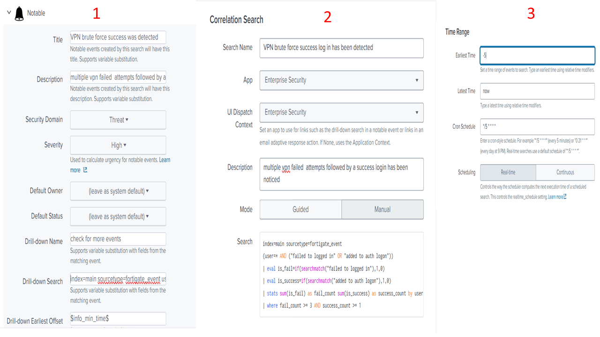
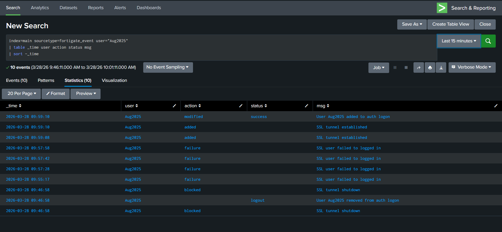
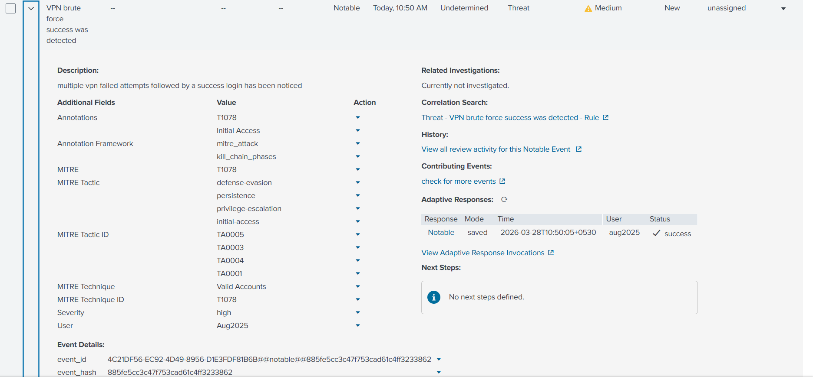
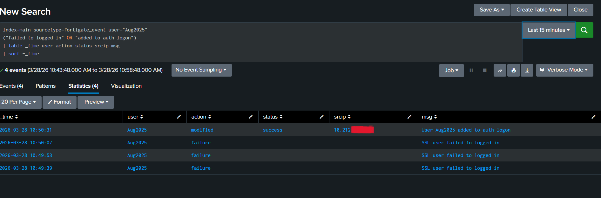
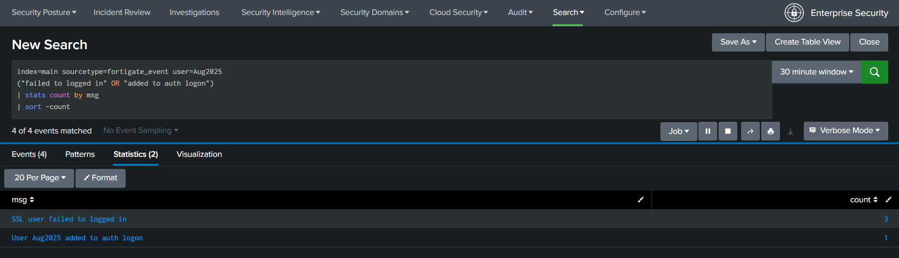

# VPN Authentication Brute Force Detection (True Positive)

## Lab Overview

### Objective

This lab demonstrates the investigation of a VPN authentication alert generated by Splunk Enterprise Security after detecting multiple failed VPN authentication attempts followed by a successful login for the same user account.

The objective of the investigation is to determine whether the authentication pattern represents normal user activity or behavior consistent with a successful brute-force attack. Every conclusion is based on the available firewall authentication logs and follows an evidence-based investigation approach.

---

## Environment

| Component | Value |
|-----------|-------|
| SIEM Platform | Splunk Enterprise Security |
| Data Source | FortiGate Firewall |
| Log Type | VPN Authentication Logs |
| Sourcetype | fortigate_event |
| Index | main |
| Detection Method | Correlation Search |
| Alert Type | Notable Event |
| Classification | True Positive |
| MITRE ATT&CK Technique | T1078 – Valid Accounts |

---

## Detection Scenario

The correlation search was designed to identify user accounts that experienced three or more failed VPN authentication attempts followed by a successful authentication.

Rather than generating alerts for isolated failed logins, the detection correlates authentication events belonging to the same user account. This approach reduces false positives caused by normal password mistakes while highlighting authentication patterns that warrant analyst investigation.

Although this behavior is consistent with password guessing or brute-force activity, the investigation relies only on the available firewall authentication logs. Additional evidence such as endpoint telemetry, identity provider logs, VPN session details, and user verification would normally be reviewed in a production SOC before confirming account compromise.

---

## Detection Logic

The detection triggers when the following conditions are met:

- Three or more failed VPN authentication attempts are recorded.
- At least one successful authentication is observed for the same user account.
- All events originate from FortiGate authentication logs.
- The correlation search generates a notable event for analyst investigation.

This logic focuses on authentication sequences that are more suspicious than isolated failed logins while reducing unnecessary alert volume.

---

## Detection Rule

```spl
index=main sourcetype=fortigate_event
(user=* AND ("failed to logged in" OR "added to auth logon"))
| eval is_fail=if(searchmatch("failed to logged in"),1,0)
| eval is_success=if(searchmatch("added to auth logon"),1,0)
| stats sum(is_fail) as fail_count sum(is_success) as success_count by user
| where fail_count>=3 AND success_count>=1
```

### Detection Rule Explanation

The search reviews FortiGate VPN authentication events, counts failed and successful authentication attempts for each user account, and returns only accounts that satisfy the defined threshold.

By correlating multiple authentication events instead of alerting on every failed login, the rule improves detection quality while reducing false positives generated by routine user mistakes.

---

## Detection Rule Configuration

The screenshot below shows the completed correlation search configuration, including the search logic, scheduling configuration, and notable event settings used to generate the detection.

**Screenshot 01 – Detection Rule Configuration**



---

## Initial Investigation

Following the generated alert, an initial review of the VPN authentication logs was performed to validate the detection and reconstruct the authentication sequence for the affected user account.

The investigation focused on identifying the number of failed authentication attempts, confirming the successful login, and verifying that all events belonged to the same user account. Reviewing the raw authentication logs allowed the alert to be validated before proceeding with further analysis.

**Screenshot 02 – Initial VPN Authentication Investigation**



---

## Generated Notable Event

After the correlation search conditions were satisfied, Splunk Enterprise Security generated a notable event to notify analysts of suspicious VPN authentication activity.

The notable event confirmed that the correlation search executed successfully and that the observed authentication sequence met the predefined detection threshold. This provided the starting point for the investigation and ensured that the activity required analyst review.

**Screenshot 03 – Generated Notable Event**



---

## Focused Investigation

A focused investigation was performed against the identified user account to reconstruct the authentication timeline.

The review confirmed three consecutive failed VPN authentication attempts followed by a successful authentication for the same account. This authentication pattern matched the intended detection logic and demonstrated behavior consistent with password guessing or brute-force activity resulting in successful authentication.

Although the available firewall logs support classifying the alert as a True Positive, they do not independently confirm account compromise or identify the individual responsible for the successful login. In a production SOC, this activity would typically be validated using additional identity, endpoint, and VPN session data before confirming malicious access.

**Screenshot 04 – Focused VPN Authentication Investigation**



---

## Authentication Statistics

Authentication statistics were reviewed to summarize the correlated events for the affected user account.

The results confirmed that the detection threshold was satisfied, with three failed authentication attempts followed by one successful authentication. These statistics support the findings observed during the manual investigation and demonstrate that the correlation search correctly identified the authentication pattern.

**Screenshot 05 – Authentication Statistics**



---

## Evidence Summary

| Evidence | Observation |
|----------|-------------|
| Failed VPN Authentication Attempts | 3 |
| Successful VPN Authentication | 1 |
| User Account | Aug2025 |
| Correlation Search Triggered | Yes |
| Notable Event Generated | Yes |
| Classification | True Positive |

---

## MITRE ATT&CK Mapping

| Technique ID | Technique | Justification |
|--------------|-----------|---------------|
| T1078 | Valid Accounts | The authentication sequence concluded with a successful login using valid credentials after multiple failed attempts, making the activity consistent with the use of valid accounts. |

---

## Final Analysis

The investigation validated that the correlation search successfully detected a sequence of three failed VPN authentication attempts followed by a successful authentication for the same user account.

The available firewall authentication logs demonstrate an authentication pattern consistent with password guessing or brute-force activity. Based on the collected evidence, the alert was appropriately classified as a **True Positive** because it matched the intended detection criteria and warranted analyst investigation.

While the authentication logs provide sufficient evidence to validate the detection, they do not independently prove account compromise or attribute the successful login to a specific individual. In a production Security Operations Center, additional evidence such as endpoint telemetry, VPN session information, identity provider logs, geolocation analysis, and user verification would typically be reviewed before confirming unauthorized access.

---

## Conclusion

This investigation demonstrates the development and validation of a Splunk Enterprise Security correlation search designed to detect suspicious VPN authentication activity.

By correlating multiple failed VPN authentication attempts followed by a successful login, the detection effectively identified authentication behavior requiring analyst attention while reducing alerts generated by isolated user mistakes.

The investigation highlights the importance of validating alerts through log analysis, documenting evidence, and reaching conclusions supported by the available data. This evidence-based approach reflects the investigation process expected within a Security Operations Center when handling authentication-related security alerts.
