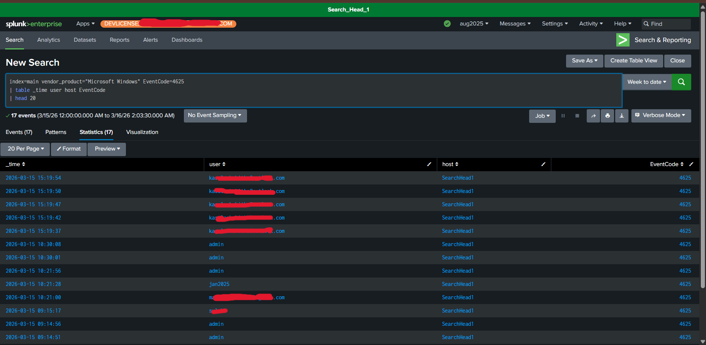
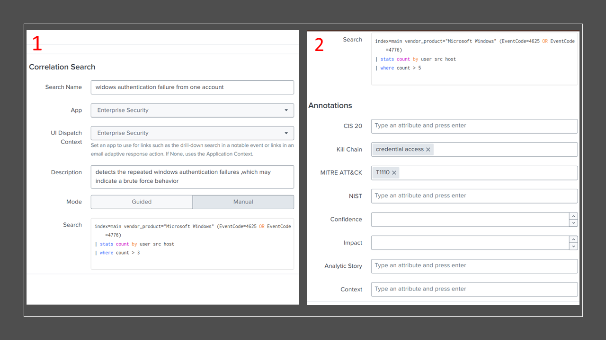
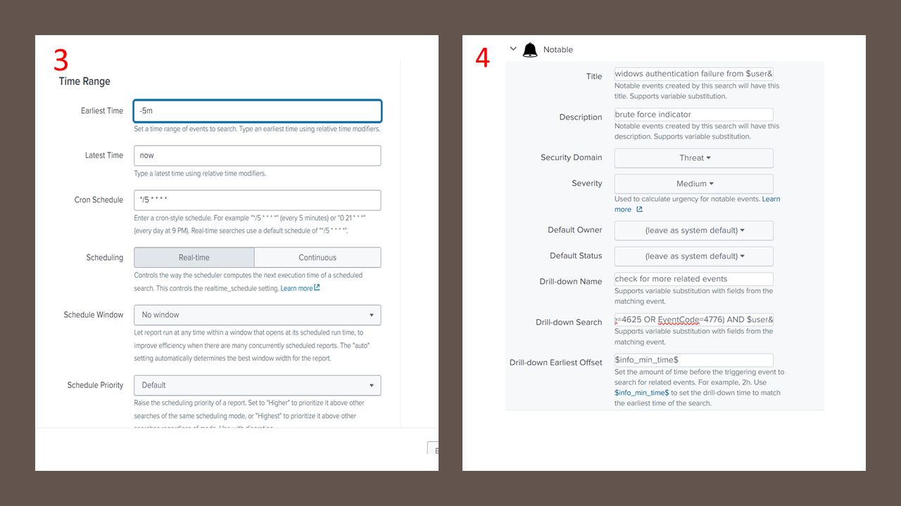
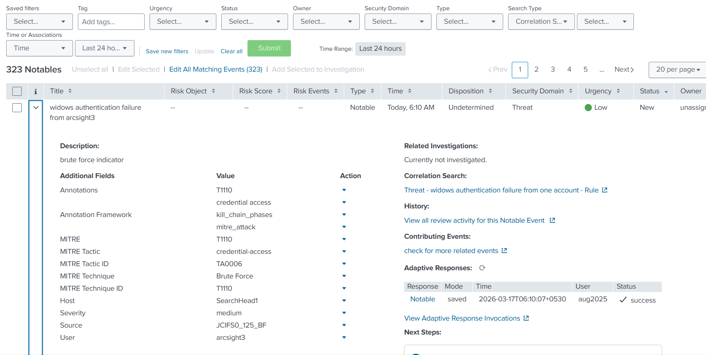
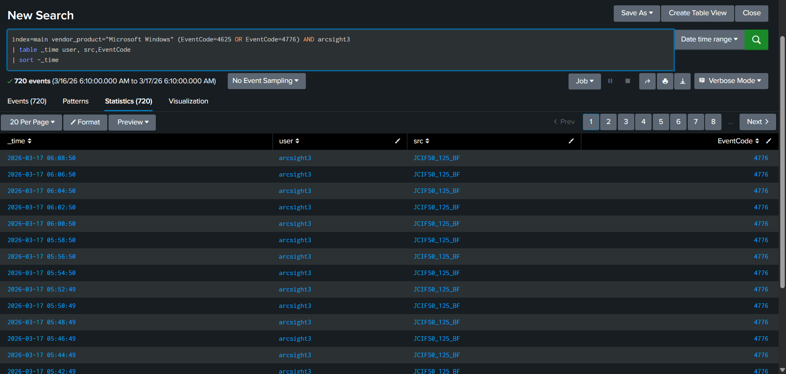
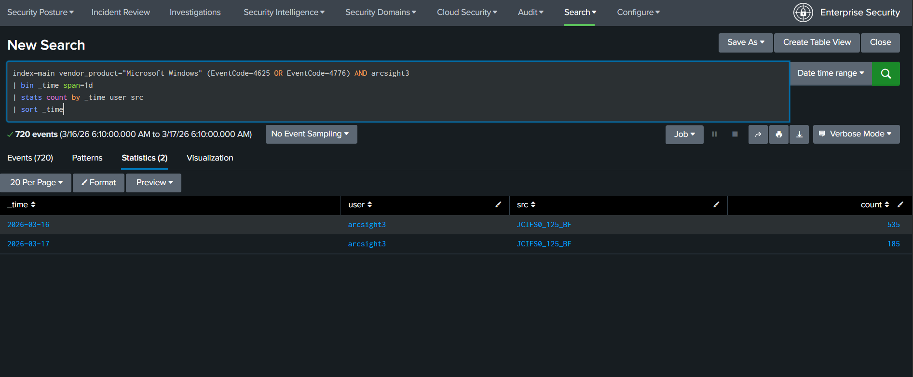

# Windows Authentication Brute Force Detection

## Lab Overview

This lab demonstrates the detection and investigation of repeated Windows authentication failures using Splunk Enterprise Security.

A correlation rule was configured to identify excessive failed authentication attempts associated with the same user account. Repeated authentication failures may indicate password-guessing or brute-force activity targeting valid credentials.

The objective of the investigation was to determine whether the observed activity represented suspicious credential-access behavior requiring analyst attention.

---

## Environment

| Component | Details |
|---|---|
| SIEM Platform | Splunk Enterprise Security |
| Index | main |
| Data Source | Microsoft Windows Logs |
| Event Codes | 4625, 4776 |

---

## Detection Logic

The correlation rule monitored Windows authentication failures and generated a notable event when the configured threshold was exceeded.

```spl
index=main vendor_product="Microsoft Windows" (EventCode=4625 OR EventCode=4776)
| stats count by user src host
| where count > 5
```

### Detection Evidence



---

## Correlation Rule Configuration

A correlation rule was configured in Splunk Enterprise Security to identify excessive authentication failures and generate a notable event for analyst review.

### Correlation Rule – Part 1



### Correlation Rule – Part 2



---

## MITRE ATT&CK Mapping

| Tactic | Technique | ID |
|---|---|---|
| Credential Access | Brute Force | T1110 |

MITRE ATT&CK Reference:

https://attack.mitre.org/techniques/T1110/

The activity was mapped to MITRE ATT&CK technique T1110 because the detection focused on repeated authentication failures that may indicate password-guessing or brute-force behavior.

---

## Alert Generation

The correlation rule successfully generated a notable event within Splunk Enterprise Security after the authentication failure threshold was exceeded.



---

## Investigation Process

The investigation focused on validating whether the authentication failures represented isolated user mistakes or repeated credential-access activity.

Authentication events were reviewed to identify:

- affected user accounts
- event frequency
- source consistency
- authentication patterns

### Authentication Investigation Timeline

The timeline showed repeated authentication failures associated with the same account over a sustained period.



---

### Authentication Failure Statistics

Additional analysis was performed to determine the volume of authentication failures.

The results showed a significant number of failed authentication events associated with the same account and source system.



---

## Analyst Findings

The investigation identified:

- repeated Windows authentication failures
- activity associated with the same user account
- activity originating from the same source system
- authentication failures exceeding the configured detection threshold
- a total of 720 authentication failure events observed during the investigation

The observed behavior was consistent with password-guessing or brute-force activity targeting user credentials.

---

## Conclusion

A notable event was generated after repeated Windows authentication failures exceeded the configured detection threshold.

Investigation confirmed a sustained pattern of failed credential validation attempts associated with the same user account and source system. The volume and consistency of the authentication failures indicated activity consistent with password-guessing or brute-force behavior.

Based on the available evidence, the activity was classified as a **True Positive detection of behavior consistent with brute-force activity** and mapped to **MITRE ATT&CK Technique T1110 (Brute Force)** under the **Credential Access** tactic.
